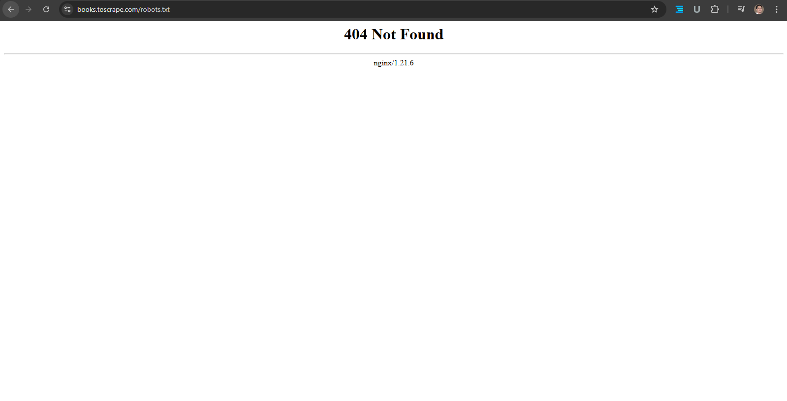
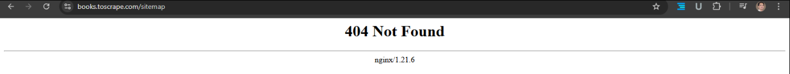
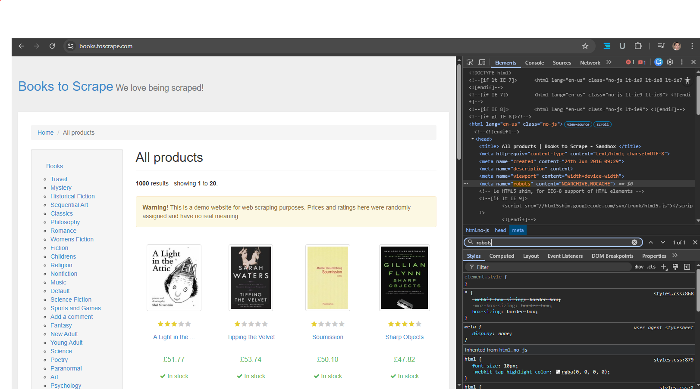
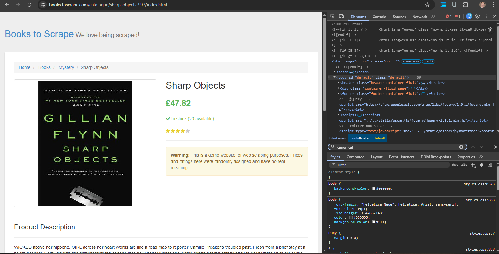
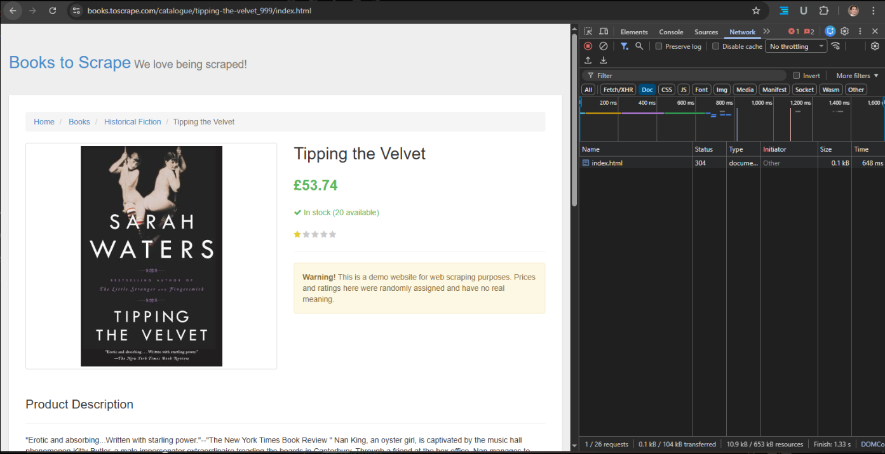

# Indexability & Crawlability Audit

## Website Audited

Books to Scrape (Demo Website)
https://books.toscrape.com

---

# Objective

The purpose of this audit is to evaluate whether search engines can properly **crawl and index website pages**. The analysis focuses on critical technical SEO signals that affect indexability.

The audit includes verification of:

* robots.txt configuration
* XML sitemap availability
* meta robots directives
* canonical tag implementation
* HTTP response codes

---

# Tools Used

* Google Chrome Developer Tools
* Chrome Network Panel
* Manual URL inspection
* Spreadsheet documentation

---

# 1. Robots.txt Analysis

**URL Tested**

```
https://books.toscrape.com/robots.txt
```

### Screenshot



### Result

Status Code: **404 Not Found**

### Analysis

The website does not provide a robots.txt file. This means search engine crawlers are not restricted from accessing any part of the website.

### Impact

* Crawlers can access all URLs
* Crawl budget cannot be optimized
* No crawler control for backend or unnecessary pages

### Recommendation

Create a robots.txt file to manage crawler access.

Example configuration:

```
User-agent: *
Disallow: /admin/
Disallow: /cart/

Sitemap: https://domain.com/sitemap.xml
```

---

# 2. XML Sitemap Analysis

**URLs Tested**

```
/sitemap
/sitemap.xml
/sitemap_index.xml
```

### Screenshot



### Result

All tested URLs returned **404 Not Found**.

### Analysis

The website does not provide an XML sitemap. Sitemaps help search engines efficiently discover and crawl indexable pages.

### Impact

* Slower discovery of new pages
* Reduced crawl efficiency
* Important pages may be discovered later

### Recommendation

Create an XML sitemap.

Example location:

```
https://domain.com/sitemap.xml
```

Example structure:

```
<urlset>
 <url>
  <loc>https://domain.com/</loc>
 </url>
</urlset>
```

---

# 3. Meta Robots Tag Analysis

Page inspected:

```
https://books.toscrape.com/
```

### Screenshot



### Tag Detected

```
<meta name="robots" content="NOARCHIVE,NOCACHE">
```

### Interpretation

| Directive | Meaning                                            |
| --------- | -------------------------------------------------- |
| NOARCHIVE | Prevents search engines from storing cached copies |
| NOCACHE   | Prevents cached result display                     |

Important observation:

The tag **does not include `noindex`**, meaning the page **remains indexable**.

---

# 4. Canonical Tag Analysis

### Screenshot



### Result

No canonical tag detected.

### Analysis

Canonical tags help search engines identify the preferred version of a page. Missing canonical tags may cause duplicate content signals if multiple URLs reference the same content.

### Recommendation

Add a self-referencing canonical tag.

Example:

```
<link rel="canonical" href="https://books.toscrape.com/">
```

---

# 5. HTTP Status Code Validation

Page tested:

```
/catalogue/tipping-the-velvet_999/index.html
```

### Screenshot



### Result

Status Code: **304 Not Modified**

### Interpretation

A 304 response indicates that the browser used a cached version of the page. This behavior is normal and does not negatively affect crawlability or indexability.

---

# Main Audit Table

| URL                                          | Status Code | Indexable | Robots.txt Allowed | Meta Robots       | Canonical | In Sitemap | Issue                 |
| -------------------------------------------- | ----------- | --------- | ------------------ | ----------------- | --------- | ---------- | --------------------- |
| /robots.txt                                  | 404         | N/A       | Yes (default)      | N/A               | N/A       | N/A        | Missing robots.txt    |
| /sitemap                                     | 404         | N/A       | Yes                | N/A               | N/A       | No         | XML sitemap not found |
| /sitemap.xml                                 | 404         | N/A       | Yes                | N/A               | N/A       | No         | XML sitemap missing   |
| /sitemap_index.xml                           | 404         | N/A       | Yes                | N/A               | N/A       | No         | Sitemap index missing |
| /                                            | 200         | Yes       | Yes                | NOARCHIVE,NOCACHE | Missing   | No         | Missing canonical tag |
| /catalogue/tipping-the-velvet_999/index.html | 304         | Yes       | Yes                | NOARCHIVE,NOCACHE | Missing   | No         | Missing canonical tag |

---

# Indexability Summary

| URL        | Crawlable | Indexable | Issue                 |
| ---------- | --------- | --------- | --------------------- |
| Homepage   | Yes       | Yes       | Missing canonical tag |
| robots.txt | Yes       |           |                       |
