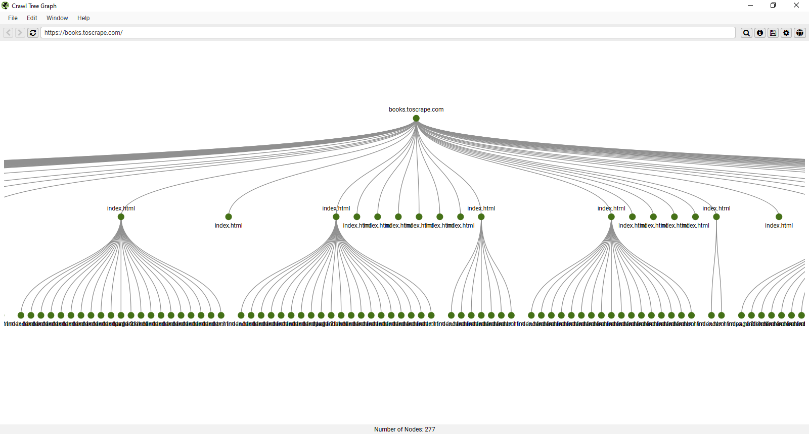
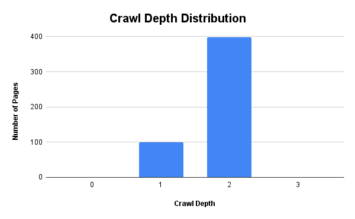

# Site Architecture & Crawl Depth Analysis

Website: https://books.toscrape.com
Audit Date: March 2026

Tools used:

* Screaming Frog SEO Spider
* Google Sheets

---

# 1. Site Structure Overview

## Findings

The crawl identified a hierarchical structure organized into several directories.

| Directory   | URLs |
| ----------- | ---- |
| Root domain | 499  |
| /catalogue/ | 275  |
| /media/     | 215  |
| /static/    | 7    |

### Analysis

The website follows a **clear category-based structure** where product pages are grouped within category directories. This type of structure helps search engines understand page relationships and improves crawl efficiency.

The `/catalogue/` directory contains the majority of the site's content, indicating that product listings are the primary focus of the website.

---

# 2. Crawl Tree Graph

## Findings

The crawl tree visualization illustrates the internal linking hierarchy.

Structure observed:

Homepage
→ Category pages
→ Product pages

### Analysis

The homepage links to multiple category pages, which then distribute links to product pages. This structure creates a logical navigation path that helps crawlers efficiently discover deeper content.

Category pages function as **internal linking hubs**, distributing authority to product pages through internal links.

---

# 3. Crawl Depth Distribution

## Crawl Depth Summary

| Crawl Depth | Pages |
| ----------- | ----- |
| Level 0     | 1     |
| Level 1     | 100   |
| Level 2     | 398   |
| Level 3     | 0     |

### Analysis

The majority of pages exist at **crawl depth level 2**, meaning they are accessible within two clicks from the homepage.

Best practice recommendations for site architecture suggest that important pages should remain within **three clicks from the homepage**.

This website meets that guideline and demonstrates an efficient crawl path.

---

# 4. Internal Linking Observations

Internal linking primarily flows from category pages to product pages.

Benefits of this architecture include:

* efficient distribution of internal link equity
* improved crawl efficiency
* logical content organization

However, deeper product pages may receive fewer internal links compared to category pages.

Strengthening internal links to high-value pages can further improve discoverability.

---

# 5. Recommendations

1. Maintain the current hierarchical site architecture.
2. Ensure important pages remain within three clicks from the homepage.
3. Strengthen internal linking to deeper pages where appropriate.
4. Regularly monitor crawl depth to ensure content remains accessible to search engines.

---

# 6. Technical SEO Summary

| SEO Area            | Status     |
| ------------------- | ---------- |
| Site architecture   | Good       |
| Crawl depth         | Efficient  |
| Internal linking    | Structured |
| Crawl accessibility | Good       |

---

# Conclusion

The website demonstrates a clear hierarchical architecture with most pages accessible within two crawl levels from the homepage. This structure supports efficient crawling and allows search engines to discover and index content effectively.

