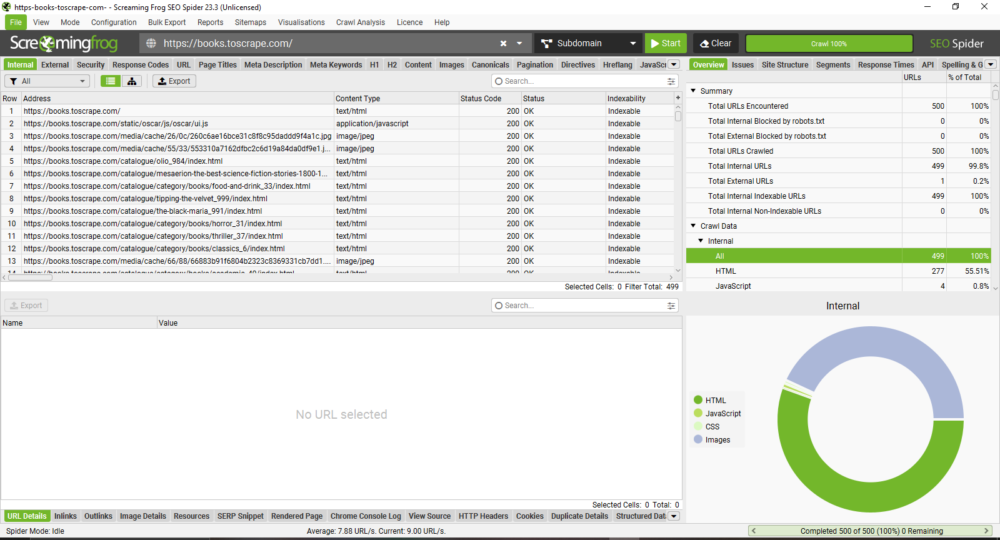
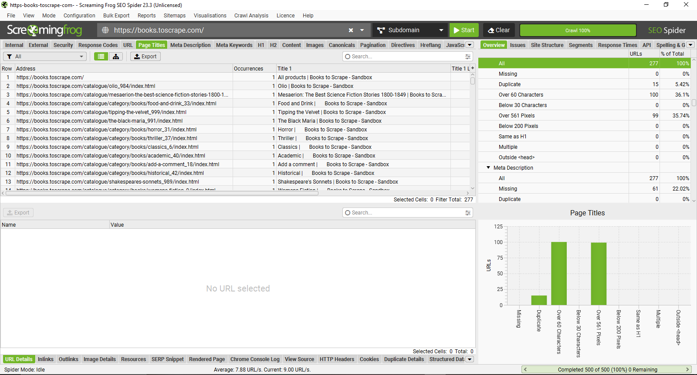
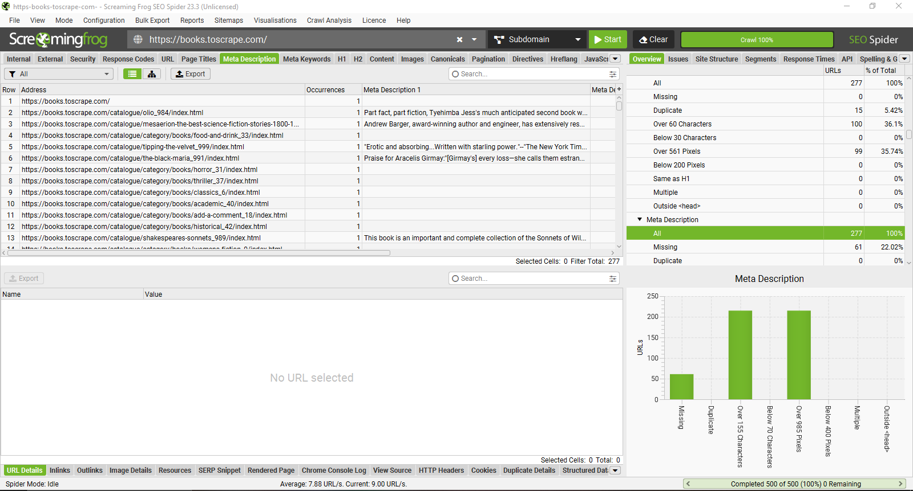
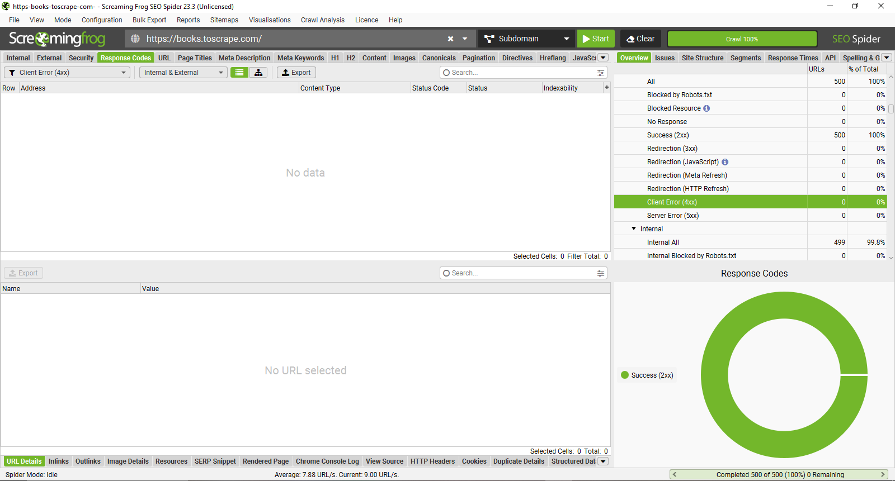
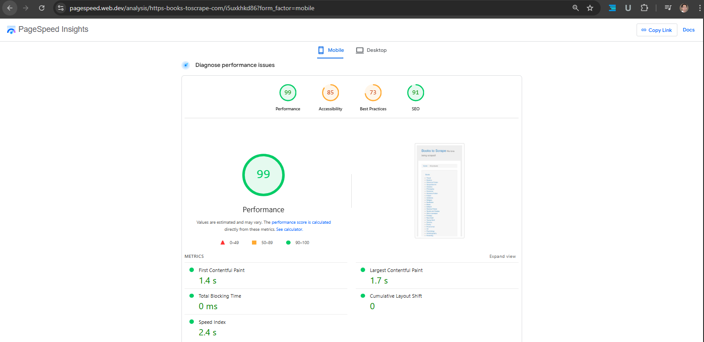
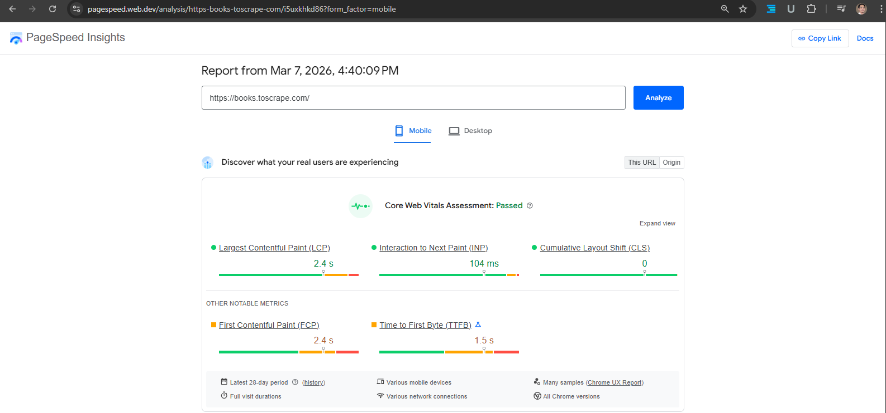

# Technical SEO Audit

Website: https://books.toscrape.com
Audit Date: March 7, 2026

Tools used:

* Screaming Frog SEO Spider
* Google PageSpeed Insights

---

# 1. Crawl Overview

A technical crawl was conducted to evaluate the site structure, crawlability, and indexability.

## Crawl Summary

| Metric                      | Value |
| --------------------------- | ----- |
| Total URLs encountered      | 500   |
| Total URLs crawled          | 500   |
| Internal URLs               | 499   |
| External URLs               | 1     |
| Internal indexable URLs     | 499   |
| Internal non-indexable URLs | 0     |
| URLs blocked by robots.txt  | 0     |

### Analysis

All discovered pages returned indexable responses and were accessible to crawlers.
No pages were blocked by robots.txt.

The crawl reached the **500-URL limit of the Screaming Frog free version**, meaning additional URLs may exist beyond the analyzed dataset.

### Recommendation

Run a full crawl without URL limits to evaluate the entire site structure and internal linking architecture.

---

# 2. Page Title Analysis

Page titles are critical on-page SEO elements used by search engines to understand page topics.

## Title Tag Summary

| Issue                        | URLs |
| ---------------------------- | ---- |
| Duplicate titles             | 15   |
| Titles over 60 characters    | 100  |
| Titles exceeding pixel width | 99   |
| Missing titles               | 0    |

### Analysis

Several pages contain duplicate or overly long titles. Titles that exceed recommended lengths may be truncated in search results.

### Recommendation

Improve title tags by:

* keeping titles under **60 characters**
* ensuring each page has a **unique title**
* including relevant keywords
* maintaining consistent formatting

---

# 3. Meta Description Analysis

Meta descriptions influence search result snippets and click-through rates.

## Meta Description Summary

| Issue                     | URLs | Percentage |
| ------------------------- | ---- | ---------- |
| Total pages analyzed      | 277  | 100%       |
| Missing meta descriptions | 61   | 22.02%     |
| Duplicate descriptions    | 0    | 0%         |

### Analysis

Approximately **22% of pages lack meta descriptions**, which may cause search engines to automatically generate snippets.

### Recommendation

Improve metadata coverage by:

* writing descriptions for missing pages
* maintaining **150–160 character descriptions**
* including relevant keywords naturally
* aligning descriptions with page intent

---

# 4. Response Code Analysis

HTTP response codes indicate whether pages are accessible to users and search engines.

## Response Code Summary

| Status Code         | URLs | Interpretation            |
| ------------------- | ---- | ------------------------- |
| 2xx (Success)       | 500  | Pages load correctly      |
| 3xx (Redirect)      | 0    | No redirects detected     |
| 4xx (Client Errors) | 0    | No broken links detected  |
| 5xx (Server Errors) | 0    | No server errors detected |

### Analysis

All crawled pages returned **HTTP 200 success responses**, indicating stable site accessibility.

### Recommendation

Continue monitoring response codes during regular SEO audits to prevent broken links or server errors.

---

# 5. Page Performance Analysis

Performance was evaluated using Google PageSpeed Insights.

## Performance Scores

| Category       | Score |
| -------------- | ----- |
| Performance    | 99    |
| Accessibility  | 85    |
| Best Practices | 73    |
| SEO            | 91    |

## Performance Metrics

| Metric                   | Result |
| ------------------------ | ------ |
| First Contentful Paint   | 1.4 s  |
| Largest Contentful Paint | 1.7 s  |
| Total Blocking Time      | 0 ms   |
| Speed Index              | 2.4 s  |
| Cumulative Layout Shift  | 0      |

### Analysis

The website demonstrates excellent performance with minimal render-blocking resources.

### Recommendation

Maintain strong performance by:

* optimizing images
* enabling browser caching
* minimizing unused CSS and JavaScript

---

# 6. Core Web Vitals

Core Web Vitals measure real-world user experience performance.

## Core Web Vitals Metrics

| Metric                          | Value  | Status    |
| ------------------------------- | ------ | --------- |
| Largest Contentful Paint (LCP)  | 2.4 s  | Good      |
| Interaction to Next Paint (INP) | 104 ms | Good      |
| Cumulative Layout Shift (CLS)   | 0      | Excellent |

### Analysis

The site **passes Core Web Vitals**, indicating a fast and stable user experience.

### Recommendation

Monitor Core Web Vitals regularly using performance monitoring tools.

---

# 7. Technical SEO Summary

| SEO Area          | Status            |
| ----------------- | ----------------- |
| Crawlability      | Good              |
| Indexability      | Good              |
| Page Titles       | Needs improvement |
| Meta Descriptions | Needs improvement |
| Response Codes    | Excellent         |
| Performance       | Excellent         |

---

# Final Recommendations

1. Perform a full crawl without the 500-URL limitation.
2. Optimize title tags to remove duplicates and reduce length.
3. Add meta descriptions to missing pages.
4. Continue monitoring performance and Core Web Vitals.

---
