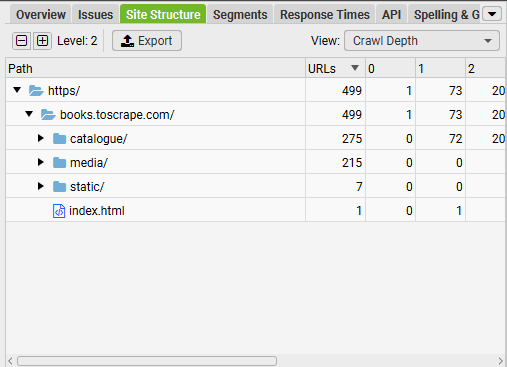
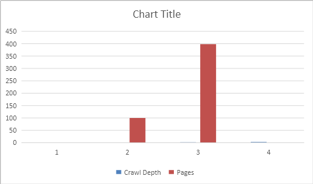

# Site Architecture & Crawl Depth Analysis

Website: https://books.toscrape.com
Audit Date: March 2026

Tools used:

* Screaming Frog SEO Spider
* Microsoft Excel

---

# 1. Site Structure Overview

## Analysis

The crawl identified a hierarchical website structure organized into several main directories.

| Directory   | URLs |
| ----------- | ---- |
| Root domain | 499  |
| /catalogue/ | 275  |
| /media/     | 215  |
| /static/    | 7    |

The site organizes content using category directories that contain product pages.
This hierarchical organization helps search engines understand the relationship between pages.

---

# 2. Crawl Tree Graph

## Analysis

The crawl tree visualization shows the internal linking hierarchy of the website.

Structure observed:

Homepage
→ Category Pages
→ Product Pages

Category pages act as hubs that distribute links to product pages.
This architecture supports efficient crawling and helps search engines discover deeper pages.

---

# 3. Crawl Depth Distribution

## Crawl Depth Summary

| Crawl Depth | Pages |
| ----------- | ----- |
| Level 0     | 1     |
| Level 1     | 100   |
| Level 2     | 398   |
| Level 3     | 0     |

## Analysis

Most pages exist at **crawl depth level 2**, meaning they are accessible within two clicks from the homepage.

Best practice recommendations suggest keeping important pages within three clicks from the homepage.
The current structure meets this guideline and supports efficient crawling.

---

# 4. Internal Linking Observations

The site uses category pages to distribute internal links to product pages.

Benefits of this structure include:

* efficient crawl paths for search engines
* logical site hierarchy
* improved discoverability of deeper pages

However, deeper pages may receive fewer internal links, which could impact crawl frequency.

---

# 5. Recommendations

1. Maintain the current hierarchical site architecture.
2. Ensure important pages remain within three clicks from the homepage.
3. Strengthen internal linking to deeper content when possible.
4. Monitor crawl depth during future technical SEO audits.

---

# 6. Technical SEO Summary

| SEO Area            | Status     |
| ------------------- | ---------- |
| Site architecture   | Good       |
| Crawl depth         | Efficient  |
| Internal linking    | Structured |
| Crawl accessibility | Good       |

---

# Conclusion

The website demonstrates a clear hierarchical architecture where most pages are accessible within two crawl levels from the homepage. This structure supports efficient crawling and helps search engines discover content effectively.
